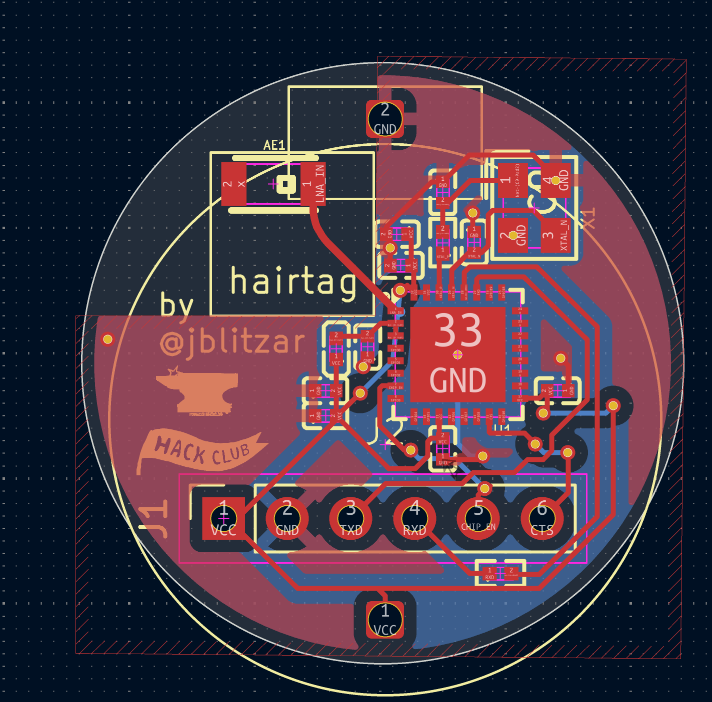
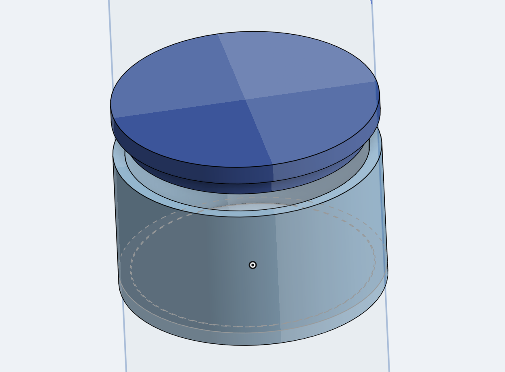

# 6/4/2026 9 AM - Research and project idea

_Time spent: 1.5h_

Basically did some research and thinking about this project. I think it has the potential to be really cool. I sent my musings in slack to ask for feedback, but here's how it's feeling so far:

I think it'd be cool to make my own airtags. There exists openhaystack firmware to connect to apple's mesh, so this is feasible at least in theory, plus there already exist third party airtags so others have done it at least
In terms of complexity, I'd imagine it's at or above a devboard.
One hard part is going to be power mangement

In terms of capable chips, I see two options: the esp32 and the nrf. Both have openhaystack ports.

esps have ble soc, and I think the c3 is pretty stripped down and optimized. It draws maybe 150 ua, so about six months on an AAA battery, pretty good

There's also the nrf, which is more "professional grade" I guess. It has a harder toolchain, but draws much less current. Even on a tiny cr2032 coin battery, it'd last a really long time. I'm leaning towards the c3 though.

With regards to that, I also have the option of using the raw qfn chip or using the package. Both fit within spatial budget.

What I'm leaning towards now is esp32c3 qfn, off the shelf external antenna, AAA battery. It's not quite the professional form factor of the coin cell x nrf, but honestly it has some charm to it. qfn feels like just the right amount of challenge, and also I want pcba :wesh:

Alright, locking things in:

- MCU: esp32c3 qfn: https://www.lcsc.com/product-detail/C2858491.html
- Antenna: Molex 2450AT18A100E (datasheet: https://www.lcsc.com/datasheet/C89334.pdf)
- Power: battery tbd (probably AAA)
- Firmware: Openhaystack for esp32
- Flashing: expose tx,rx,gnd,boot,en plus CP2102

# 6/4/2026 4 PM - Schematic and Placement

_Time Spent: 3h_

Found a great datasheet on the esp32, https://docs.espressif.com/projects/esp-hardware-design-guidelines/en/latest/esp32c3/esp-hardware-design-guidelines-en-master-esp32c3.pdf

Absolute gold mine; It has a reference design.

Anyways, useful stuff for the future:

1uf: C52923
inductor: C76769 2nH
100nf: C1525
10uf: C15525
10nf: C15195
499Ω: C2960788
crystal: C5444549 (specify 10pf) (datasheet: https://www.lcsc.com/datasheet/C5444549.pdf)
15pf: C1548
24Ω: C270625

Here's what it looks like!

And the placement: 

I also researched firmware, I found this lovely implementation at https://github.com/timbeh/esp32c3-openhaystack/tree/main .
Now, if it advertises for just 20ms and then deep sleeps for the rest of the ten seconds, that consumes ) = 0.03996 mA, so on a 220 mAh battery, that's 229 days of life!! This is pretty great, so we don't even need to worry about optimizing life. No nrf regrets.

So the coin cell is back on the table. So I just slightly redesigned the form factor. Honestly, this is pretty good to almost start routing.

Actually, update: I was able to fully fit the whole thing inside a 22mm circle.

Things to consider with routing:
 - Silly stuff with the impedance of the antenna (most annoying)
  - Double check this with the datasheet.
  - Also keep out zone
 - Caps, antenna, crystal should all be via-free, the rest is fair game (signal, ground, power)
  - What this likely means is that I should route these first. 

# 6/4/2026 9 PM - First pass on routing

_Time Spent: 0.5h_

Reasonably fast routing thanks to my immaculate placement lol, just a bit of nudging around.

DRC passes! Just had to connect all the gnd planes, no other issues

Impedence calculators said that I would need a 3mm (!!) thick trace for my ble, but the pitch on the qfn package is literally 0.5mm. According to the internet, at my type of application, honestly, impedence matching is not allat. It'll be a negligible difference, I'm not trying to squeeze every last db out of this, it just needs to transmit to the nearest phone. So I guess I'll be getting 109Ω impedance instead of the reccommended 50Ω.

Internet says: "A safe rule of thumb in digital and low-frequency design is that if your trace or wire is less than 1/10 of the signal's wavelength, transmission line effects don't matter. Reflections won't have time to interfere with the original signal." My wire is 6mm and ble is 2.4ghz, so that's like 120mm. So I am fine.

Picture: 

TODOs eventually:
 - add silkscreen art
 - add the rest of the docs to make it shipped. This means:
  - BOM fully figured out (this has items not in pcba like the batteries!)
  - nice readme
  - nice case
  - et al.

We'll see how pricing comes out.

# 6/5/2026 3 PM - Silkscreen, BOM, docs

_Time Spent: 2.5h_

BOM optimization: swapped 4 extended LCSC parts for basic equivalents to cut PCBA costs.

https://basicp.art/ is such a gem of a resource

- C29266 -> C52923
- C60474 -> C1525
- C315248 -> C15525
- C86285 -> C1548

I also fleshed out the sourcing for the rest of the parts. I could spend some more time looking at alternatives, but it's about as cheap as it's going to get. I have as many Basic parts as possible, I'll probably pay for battery holders out of pocket, and a cheaper CP2102 will save me only like $5.

So while I was looking at my battery holders, I realized that I don't actually have to solder any bodge wires, and that there exists one with a very slick PCB integration. So I designed up a footprint and put it in. 

See, those pins can actually go into tht pads. These folks did it:

Alright, time to design a case.

I think a simple press fit will do. This is a ~25.5mm diameter circle, which accounts for the weird overlapping footprints. It'll be a weird fit, but it'll look cool on the outside

Next up, I wrote the README. For next session, I'll want to make a nicer render in blender, clean up the traces until they're *perfect*, and make sure that I all the proper documentation sorted here. (seems like I'll need a step file with my whole assembly)
