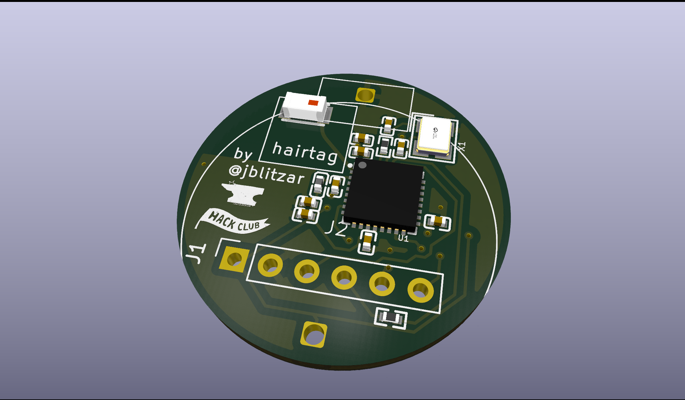
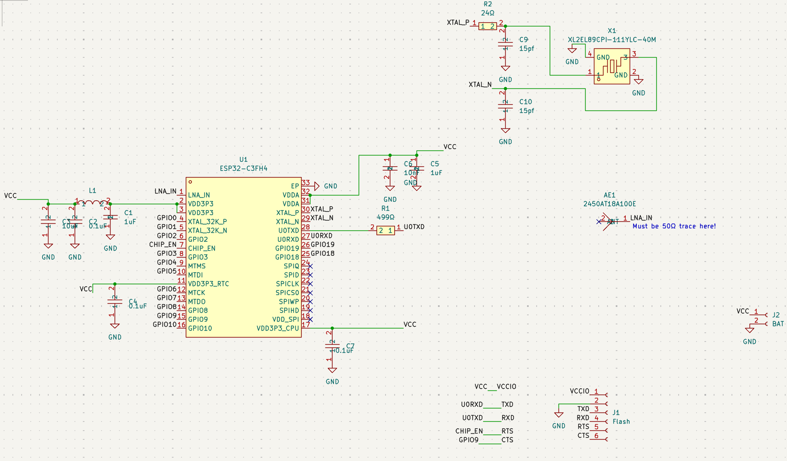

# hairtag

homemade airtag that's genuinely pretty good

 - ESP32C3 chip, openhaystack firmware (more FOSS than Apple, no crazy custom die)
 - 22mm diameter board (smaller than Apple's 33, although technically the product is taller overall)
 - Probably costs less than Apple (but if cost was really what you were hoping for, buy an aliexpress knockoff)
 - Comparable battery life to apple! (~229 days theoretically)
 - Designed in California (just like apple lol)

 ## Why I made this project

 I thought airtags were pretty cool. A while ago I was scrolling Github and I came across [openhaystack](https://github.com/seemoo-lab/openhaystack) (btw Seemoo lab has done all sorts of cool things that I've used before, shoutout to nexmon and opendrop). 

 Anyways, I figured I could make my own. It's good experience, because you basically get all the components of a devboard, plus power budgeting, and interesting firmware. Plus, I already own 10000 devboards but I own zero airtags so this is a product that I'd actually use and want. A project that has both cool value and educational value gives you so much more motivation than one that only has the latter. 

## Schematic

## PCB

## Bom

|Item                     |Link                                                                     |Cost |Notes                                                                                                                       |Running Total|
|-------------------------|-------------------------------------------------------------------------|-----|----------------------------------------------------------------------------------------------------------------------------|-------------|
|CP2102 for flashing      |http://waveshare.com/cp2102-usb-uart-board-type-a.htm                    |4.99 |This one has a specific pinout that's useful, also waveshare's more reputable                                               |4.99         |
|PCB + PCBA + JLC shipping|N/A                                                                      |42.02|Cost for 2x pcba. I'm willing to pay $4 extra out of pocket to get the 5x PCBA                                              |47.01        |
|CR2032 batteries         |https://www.aliexpress.us/item/3256808176964698.html                     |0    |self-sourced, alt amazon link: https://www.amazon.com/Energizer-2032-Battery-CR2032-Lithium/dp/B0042A9UXC?th=1              |47.01        |
|battery holder           |https://www.amazon.com/RuiLing-CR2032-Button-Battery-Holder/dp/B07PNK5D6H|6.69 |it's actually cheaper than what I could find on aliexpress (at least that had the footprint that I wanted and free shipping)|53.7         |
|Shipping / taxes         |N/A                                                                      |11   |TBD, from all the other ones not counting pcba                                                                              |64.7         |
|Case (printed)           |N/A                                                                      |0    |self-sourced, alternatively print legion is also free                                                                                                                |64.7         |
